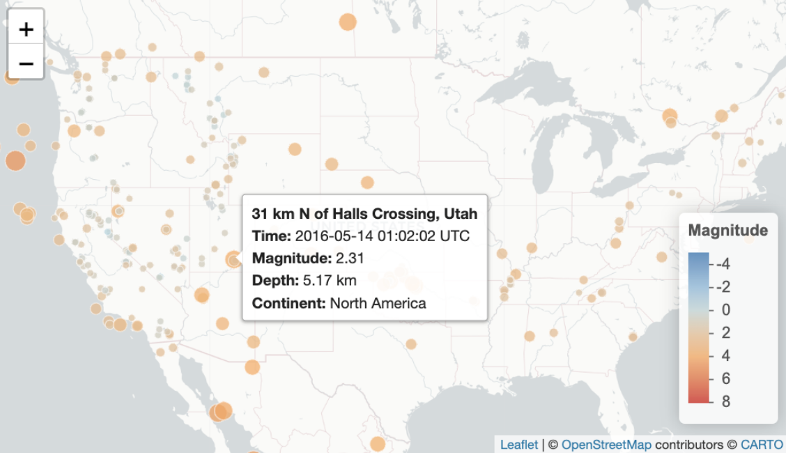
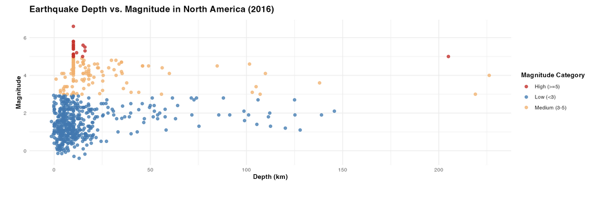
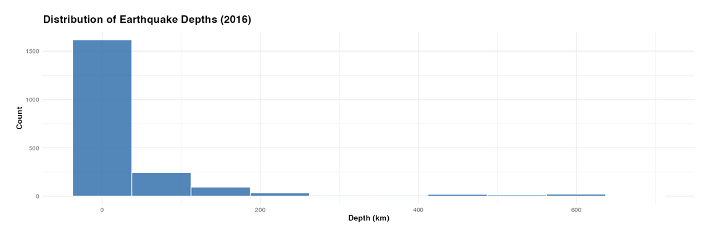
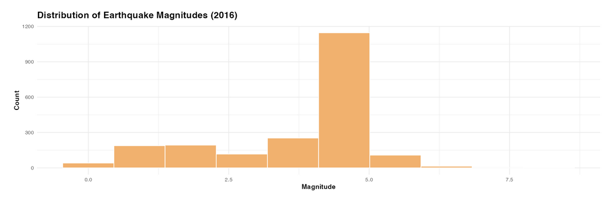
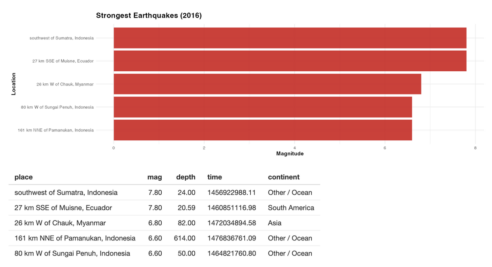

## Opening

Earthquakes are often thought of as rare, catastrophic events: sudden disasters that strike without warning. However, a closer look at global seismic data reveals a different truth: earthquakes happen constantly, all around the world. The real question is not whether earthquakes occur, but where, how often, and how severe they truly are.

To better understand these patterns, we analyzed earthquake data from 2016, focusing on location, depth, and magnitude. By exploring both global trends and local behavior, this analysis reveals that while earthquakes are widespread, most are far less dramatic than we might expect, and only a small fraction pose significant risk.

## Where Earthquakes Happen

At a global scale, earthquakes are not randomly distributed. Instead, they cluster in distinct geographic regions, particularly along tectonic plate boundaries. The western coast of North America, parts of South America, and regions near the Pacific Ocean show especially high concentrations of seismic activity.

This clustering highlights the underlying structure of the Earth's crust. Areas where tectonic plates meet or shift are far more likely to experience earthquakes, reinforcing the idea that geography plays a critical role in seismic risk.

## Most Earthquakes Are Small and Shallow

While earthquakes occur frequently, their characteristics follow clear patterns. Most earthquakes are shallow and low or moderate in magnitude. The distributions of depth and magnitude are heavily skewed, with a large concentration of events occurring at low depths and magnitudes below 3.

This is a surprising finding. Despite the attention given to large earthquakes, the overwhelming majority of seismic activity consists of minor events that often go unnoticed. Deep or high-magnitude earthquakes do occur, but they are relatively rare compared to the total number of events.

## Depth Does Not Strongly Predict Magnitude

One might expect that deeper earthquakes are more powerful, but the data suggests otherwise. The relationship between depth and magnitude appears weak, with earthquakes of varying magnitudes occurring across a wide range of depths.

Most earthquakes cluster at shallow depths with low magnitudes, but even at greater depths, magnitudes do not consistently increase. This indicates that depth alone is not a reliable predictor of how strong an earthquake will be.

## The Exceptions: Rare but Powerful Events

Although most earthquakes are small, a few stand out as significantly stronger. These high-magnitude events are rare but concentrated in specific regions, often along major tectonic boundaries. By examining the strongest earthquakes, we see that these events are not evenly distributed. Instead, they tend to occur in areas already known for seismic activity. This reinforces the idea that while earthquakes are common, meaningful risk is concentrated in particular locations.

## Conclusion

Taken together, these findings reshape how we think about earthquakes. Rather than being rare, unpredictable disasters, earthquakes are a constant feature of the Earth's natural processes. However, most are minor, shallow, and unlikely to cause harm.

The true risk lies not in the frequency of earthquakes, but in the small number of powerful events that occur in high-risk regions. Understanding these patterns allows us to better prepare for the earthquakes that matter most: those with the potential to cause significant damage.

Ultimately, this analysis highlights a key insight: **Earthquakes are everywhere, but danger is not.**

## Explore

Use the [USGS Earthquakes Explorer](https://mliv.shinyapps.io/earthquakes/) to discover earthquake patterns and risks near your city or all around the world.

::: {.column-screen}
<iframe src="https://mliv.shinyapps.io/earthquakes/" width="100%" height="900px" style="border: none; border-radius: 16px;"></iframe>
:::
